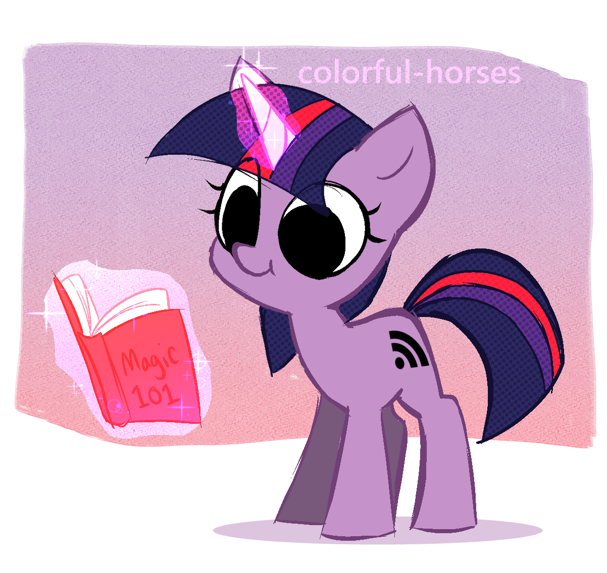

# RSS my ass

[@rss_my_ass_bot](http://t.me/rss_my_ass_bot)

This Telegram bot is able to generate RSS feeds for YouTube channels and playlists. Send `/help` to see what it can do.

## Self hosting

Of course you can selfhost it. Just [create new Telegram bot](https://core.telegram.org/bots) and use provided token as `TOKEN` environment variable upon startup. After that you can simply run it however you like, I'll provide [Dockerfile](Dockerfile) just in case.

---

You can help me to pay electric bill if you're not feeling like hosting it yourself

---

